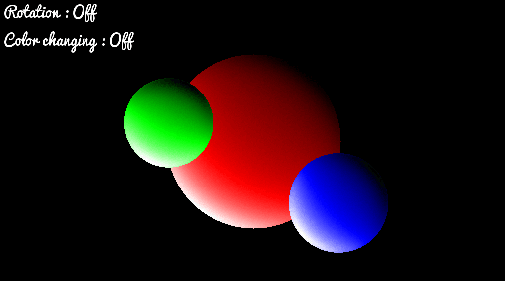

# Raytracer

###Demo :


### Utilisation:
```
$ cd bonus
$ make re
$ ./raytracer1
```

### Informations sur le projet:

Le ray tracing consiste, pour chaque pixel de l'image à générer, à lancer un rayon depuis le point de vue (la caméra) dans la scène 3D. 

Le premier point d'impact du rayon sur un objet définit l'objet concerné par le pixel correspondant.

Suit l'ancienne norme Epitech.

Plus d'informations dans raytracer.pdf.
